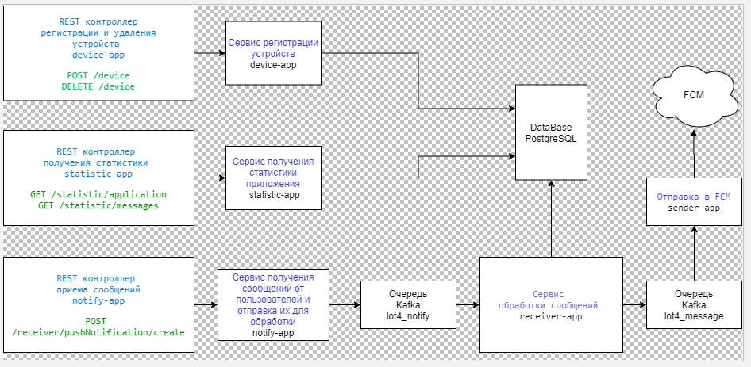

### Тестовое задание МТС

[Само задание](doc/Lot4Java.docx)

Система состоит из модулей:

- [Регистрация устройств](device-app/Readme.md)
- [Приемник событий](notify-app/Readme.md)
- [Обработка событий](receiver-app/Readme.md)
- [Отправка в FCM](sender-app/Readme.md)
- [Получение статистики](statistic-app/Readme.md)
- [Web-интерфейс](front-app/README.md)



### Сборка

````
mvn clean package -DforkCount=0
````

### Тестовое развертывание

````
docker-compose up
````

### Логирование

В контейнере развернут Graylog на [http://127.0.0.1:9999](http://127.0.0.1:9999). Имя/пароль: admin/admin. Для приема логов от программ нужно добавить Input Stream __GELF UDP__ на порту 12201

### Доступ к UI

````
http://localhost:4200
````
