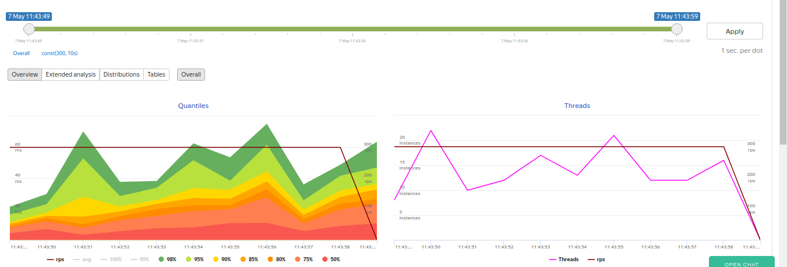

### Результаты нагрузочных испытаний

Тесты проводились с помощью yandex-tank в docker контейнере. Контейнер и yandex-tank запущены на одной и той же машине. Все микросервисы и службы запущены в одном экземпляре. 

Задана нагрузка 300rps. Результаты показали в 95% время ответа меньше 50ms.

